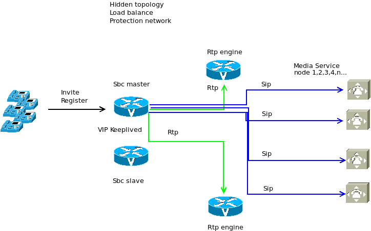

### <b> About project </b>
This configuration for opensips was customized, written and tested for opensips version 2 and had serious memory leak issues due to lua. The leak issue has been resolved in opensips version 3.
### <b> Configuration functions </b>
  The configuration serves three main functions of sbc:
  a) Protection of the network perimeter.
  The answer to the methods of the sip dialogue is possible only after preliminary authentication, for which the user_id of the packet is compared with the
  available data in the subscriber sbc table.
  To speed up packet processing, data on them is cached in the memcached container.
  The packet processing speed is handled by the pike module.
  b) Hiding the topology
  The module for hiding the topology topology_hiding is used, which hides the topology of media servers (for example, based on asterisk, freeswitch) behind sbc.
  c) Load balancing
  The balancer module is executed, which, according to a given algorithm, balances the load of calls to execute the logic of dwo.
  
In addition, sbc acts as a registrar both for its terminals and for interfaces with telecom operators, including when working through nat. Rtp processing is  proxied by rtpengine where streams can be written.
  Opensips database modified tables can be found in the appropriate directory.
